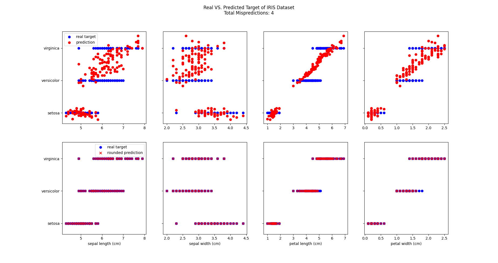

# IRIS_ML

An Implementation of Machine Learning on [IRIS Dataset](https://en.wikipedia.org/wiki/Iris_flower_data_set) using [scikit-learn](https://scikit-learn.org/), [Matplotlib](https://matplotlib.org/) and [Numpy](https://numpy.org/)

> Average misprediction: 3.3%